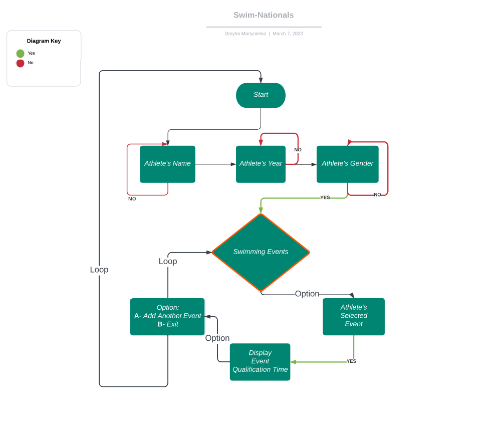
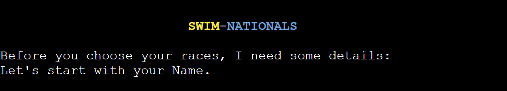
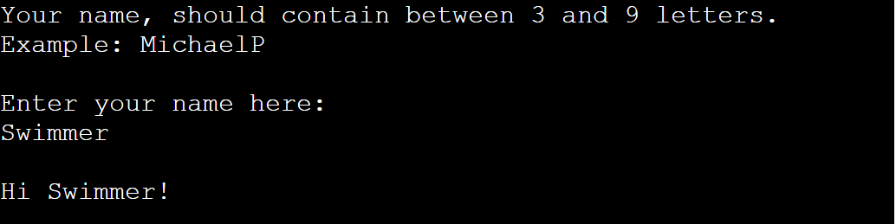
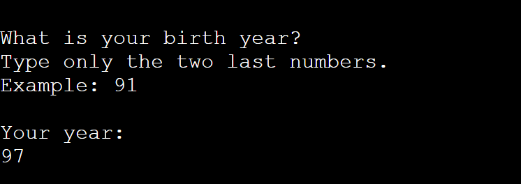
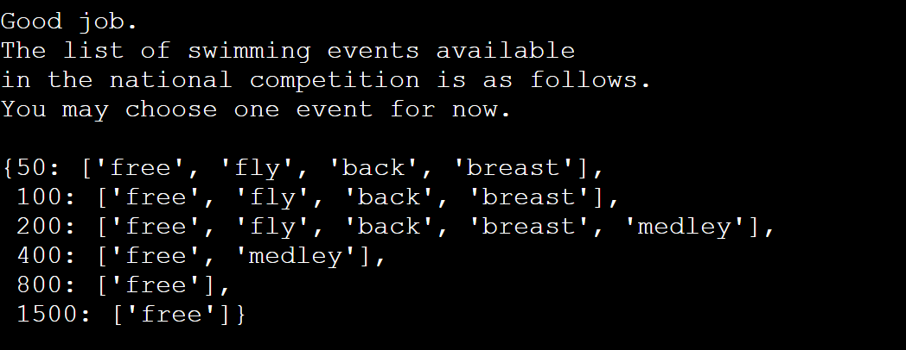
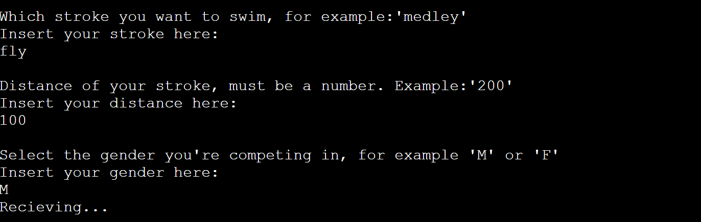
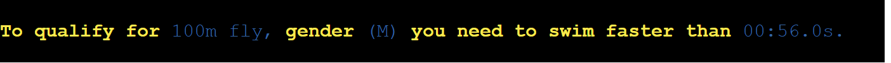
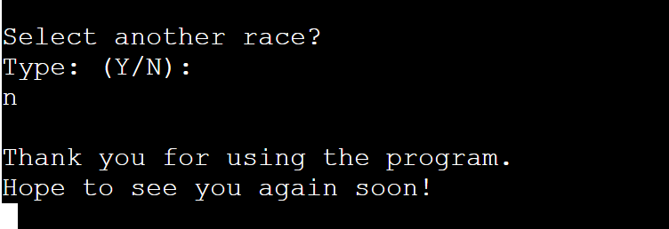

# Swim-Nationals

The aim of this project is to assist swimming coaches in registering their athletes for competitions. When coaches have a large group of athletes competing in different races, they must devote a significant amount of time to organizing and registering each athlete and their strokes for the event. However, this project simplifies the process by using a Google Sheet, to strore usere's information where athletes can choose what they want to swim, and coaches can then register them for the competition.

National competitions are one of the most important events, as athletes strive to perform their best. To participate, athletes must meet the minimum requirements, which include qualification times. Each country has its own criteria for determining these times. For example, in Germany, the qualification times are based on the 40 fastest swimmers in each stroke and distance. The 40th place time from the previous year is used as an estimate for the following year. Therefore, even if an athlete swims a similar time to the previous year's 40th place, there is no guarantee that they will qualify for the event.

This project provides swimmers with an estimate of the qualification time required for each stroke and distance at national competitions. It also helps coaches save valuable time by simplifying the bureaucratic process of registering their athletes for competitions.

## User Goals:

* Develop an intuitive and user-friendly program to select swimming events.
* Provide clear instructions for users on how to enter values.
* Highlight important information for a better user experience
* Update the Orders data sheet with accurate values
* Display the qualification time and other variables chooses by the user

## User Stories:

* As a user, I want to view the qualifying times to diferent eventst and distances
* As a user, I want to personalize the response with my own data.
* AS a user, I want to be able to choose as many events as I like.

## Scope:

* Show users their options
* Display warnings for incorrect input formats
* Gives a qualifying time depending on the gender, stroke, and distance
* The program appends the user's choices to the sheet.

## Flowchart

Lucidchart was used to create the Flowchart for my program, helping visualize the steps that the program does.

## Features
### Existing Features

 
 

#### Welcome to Swim-Nationals
* User is welcomed by the program.
* Placed in the middle of the screen
* Welcome message displayed with colors

 
 

#### Name
* The name is asked with clear instructions
* Name must be a letter, without special characters
* After the users input the program greats the user back.

 
 

#### Year
* Year is asked with intuitive instructions.
* Year must only contain two numbers.
* Validation of the year doesn't allow any letters to pass trought

 
 

#### Swimming Events List
* After entering correct information the user is congratulated.
* List of possible swimming events is shown to the user

 
 

#### Event Selection
* User is asked to input the stroke of the event
* Program gives a clear example of how to enter the stroke
* User is asked to input the distance of the event
* Program gives a clear example of how to enter the distance
* User is asked to input the gender in which the user competes
* Program gives an option to select: M/F.
* User inputs are validated.

 
 

#### Qulifying Time
* Users' stroke, distance and gender are displayed.
* Qualifing time is shown to the user's specific input.
* Message is printed with different colors, user's input are shown in blue color
* Afer the message is printed, users details are saved in the sheet.

 
 

#### What to do next?
* User is given an option to select another event or to exit the program.
* Only (Y/N) are valid, any other letter will display an error.
* When key "Y" is pressed the user is redirected to the name section.
* When key "N" is pressed a see you soon massage is printed.

