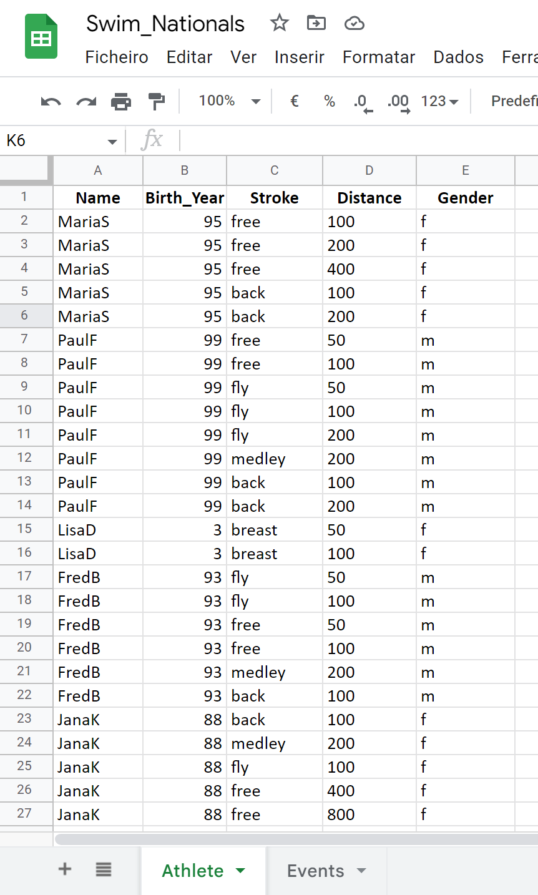

# Swim-Nationals
## Overview 
This program aims to assist swimming coaches in registering their athletes for competitions. When coaches have a large group of athletes competing in different races, they must devote a significant amount of time to organizing and registering each athlete and their strokes for the event. However, this project simplifies the process by using a Google Sheet, to store user information where athletes can choose what they want to swim, and coaches can then register them for the competition.

National competitions are one of the most important events, as athletes strive to perform their best. To participate, athletes must meet the minimum requirements, which include qualification times. Each country has its criteria for determining these times. For example, in Germany, the qualification times are based on the 40 fastest swimmers in each stroke and distance. The 40th place time from the previous year is used as an estimate for the following year. Therefore, even if an athlete swims at a similar time to the previous year's 40th place, there is no guarantee that they will qualify for the event.

This project provides swimmers with an estimate of the qualification time required for each stroke and distance at national competitions. It also helps coaches save valuable time by simplifying the bureaucratic process of registering their athletes for competitions.

 

[View Website on Heroku](https://swim-nationals.herokuapp.com/)
 

[Sheet available here](https://docs.google.com/spreadsheets/d/1RvxTkTHv6Lywv2zcsbmAyWENt25fgomM6UokpF4NbYA/edit?usp=sharing)
 

# Table Of Contents

- [Swim-Nationals](#swim-nationals)
    - [Overview](#overview)
    - [User Goals](#user-goals)
    - [User Stories](#user-stories)
    - [Scope](#scope)
    - [Flowchart](#flowchart)
    - [Features](#features)
        - [Existing Features](#existing-features)
            - [Welcome](#welcome-to-swim-nationals)
            - [Name](#name)
            - [Year](#year)
            - [List](#swimming-events-list)
            - [Events](#event-selection)
            - [Qualifying time](#qualifying-time)
            - [What to do next?](#what-to-do-next)
            - [Sheet](#sheet)
        - [Future Features](#future-features)
    - [Bugs](#bugs)
    - [Technologies Used](#technologies-used)
    - [Testing](#testing)
        - [Validator Testing](#validator-testing)
    - [Deployment](#deployment)
    - [Credits](#credits)
    - [Acknowledgements](#acknowledgements)

## User Goals:

* Develop an intuitive and user-friendly program to select swimming events.
* Provide clear instructions for users on how to enter values.
* Highlight important information for a better user experience
* Update the Orders data sheet with accurate values
* Display the qualification time and other variables chosen by the user

## User Stories:

* As a user, I want to view the qualifying times for different events and distances
* As a user, I want to personalize the response with my data.
* AS a user, I want to be able to choose as many events as I like.

## Scope:

* Show users their options
* Display warnings for incorrect input formats
* Gives a qualifying time depending on the gender, stroke, and distance
* The program appends the user's choices to the sheet.

## Flowchart

Lucidchart was used to creating the Flowchart for my program, helping visualize the steps that the program does.

 
 

## Features
### Existing Features
 

#### Welcome to Swim-Nationals
* User is welcomed by the program.
* Placed in the middle of the screen
* Welcome message displayed with colors

 
 

#### Name
* The name is asked with clear instructions
* Name must be a letter, without special characters
* After the users input the program greats the user back.

 
 

#### Year
* Year is asked with intuitive instructions.
* Year must only contain two numbers.
* Validation of the year doesn't allow any letters to pass through

 
 

#### Swimming Events List
* After entering the correct information the user is congratulated.
* List of possible swimming events is shown to the user

 
 

#### Event Selection
* User is asked to input the stroke of the event
* Program gives a clear example of how to enter the stroke
* User is asked to input the distance of the event
* Program gives a clear example of how to enter the distance
* User is asked to input the gender in which the user competes
* Program gives the option to select: M/F.
* User inputs are validated.

 
 

#### Qualifying Time
* Users' stroke, distance, and gender are displayed.
* Qualifying time is shown to the user's specific input.
* Message is printed with different colors, user's input is shown in blue color
* After the message is printed, the user's details are saved in the sheet.

 
 

#### What to do next?
* User is given the option to select another event or to exit the program.
* Only (Y/N) are valid, any other letter will display an error.
* When key "Y" is pressed the user is redirected to the name section.
* When key "N" is pressed a see you soon message is printed.

 
 

#### Sheet
* User details stored in the sheet

 
 

### Future Features
* Select more than one event at the same time
* Let the user's qualification time be compared with the user's actual swimming time.

## Bugs

After presenting the list of swimming events, the user is asked to input their preferred stroke and distance. However, the program currently only confirms the user's selection after they have entered both pieces of information, even if one or both are incorrect. For example, if the user correctly selects the stroke but enters an incorrect distance, the program will only notify them of the error after they have also entered their gender.

To address this issue, a possible solution would be to limit the user's stroke and distance choices to a pre-defined set of options, like the one in the dictionary attributing a key for distances and values to strokes. This would ensure that the user only enters valid combinations of stroke and distance, and would reduce the likelihood of errors or confusion.

## Technologies Used
* Gspread
* Colorama
* google.oauth2.service_account
* Gitpod
* GitHub
* Heroku
* Lucidchart
* PEP8

## Testing
* PEP8 code validator was used to find and eliminate issues.
* When invalid inputs are entered, the program returns until the expected ones are selected.
* Tested multiple times to showcase hypothetical user's details being printed to the sheet. 
* Tested in combination with my mentor. Bugs are reported in the section above. 

### Validator Testing
* PEP8, all errors fixed.

## Deployment
Steps to deployment were followed from Code Institute learning material.
 

* Sign in to your Heroku account.
* Access the main page and click the "New" button in the top-right corner. Choose "Create New App" from the drop-down menu.
* Choose a unique name for your app and select the region.
* Once the app is created, go to the Deploy Tab and select the "Settings" Tab. Scroll down to "Config Vars".
* Click "Reveal Config Vars" and enter "port" as the key, and "8000" as the value. Click "Add" to confirm the entry.
* Next, enter your Google credentials into the "CREDS" key and value fields.
* Go back to the Buildpack section and select "python", then click "Save Changes". Repeat this step to add "node.js", ensuring that the Buildpacks are in the correct order.
* Go to the "Deploy" tab and select "Github" as the deployment method. Confirm that you want to connect to GitHub and search for the repository name.
* Scroll to the bottom of the page and choose your preferred deployment type.
* Finally, click "Manual Dedploy".
* Fork this repository

## Credits
* Code Institute learning material.
* Code Institute template.
* Love sandwiches, walkthrough project. Learning how to append to google sheets and use credentials. Also, youtube video tutorials https://www.youtube.com/watch?v=4ssigWmExak  and https://www.youtube.com/watch?v=bu5wXjz2KvU

* German Swimming Federation to find the cut off times https://www.dsv.de/schwimmen/dsv-wettkampf-veranstaltungen/dm-langbahn/ 

* Documentation for Google API https://developers.google.com/drive/api/guides/about-sdk

* README inspired in the https://github.com/PedroCristo/portfolio_project_3 and https://github.com/useriasminna/american_pizza_order_system

## Acknowledgements
- To the great helping community at Code Institute.
- Thanks to my mentor Adegbenga Adeye, for checking up with me and providing material and feedback.
- Thanks to Paul Thomas O’Riordan,  Cohort Facilitator for valuable group discussions.

